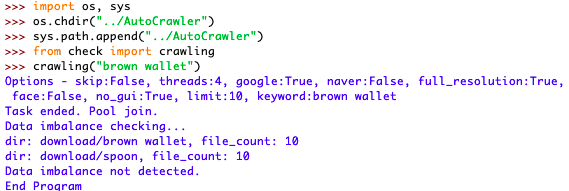

# AutoCrawler
Google multiprocess image crawler (High Quality & Speed & Customizable)




# How to use

1. Install Chrome

2. pip install -r requirements.txt. You also might need to install other dependencies such as Selenium.

3. **Run "crawling(keyword)"** which is located in check.py. Also, it is possible to run the crawler from command line with following command: 
```
  python3 main.py --keyword "your keyword"
  
```

4. Files will be downloaded to 'download' directory.

**NOTE**: Make sure that the python shell is inside AutoCrawler folder. In case there is a ChromiumDriver problem, you will have to download appropriate one and put it inside **chromedriver** folder. 


# What it does

It crawls google and downloads 10 full resolution images and then resizes every image to 500x500. 

# Issues

It is a customized version of https://github.com/YoongiKim/AutoCrawler. 
